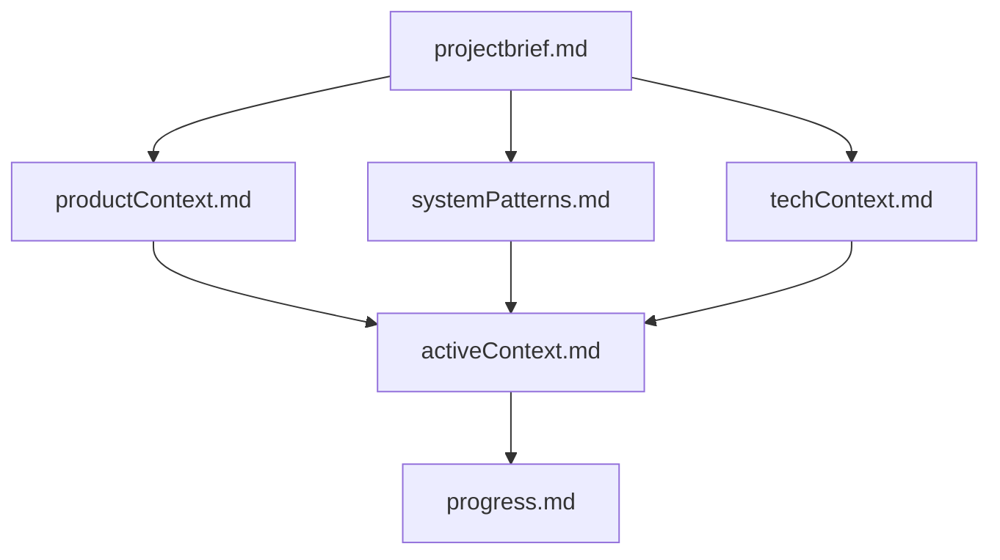

# Memory Bank — Instructions (méthodologie Cline)

Ce dossier est la **mémoire persistante** du projet Charles Berard. Les agents (Cursor, Cline, etc.) doivent le traiter comme source de vérité entre sessions.

## Hiérarchie des fichiers



| Fichier | Rôle | Fréquence de mise à jour |
|---------|------|--------------------------|
| `projectbrief.md` | Scope, objectifs, contraintes | Rare (changement de scope) |
| `productContext.md` | Produit, UX, utilisateurs | Occasionnel |
| `systemPatterns.md` | Architecture, patterns code | Après refactors majeurs |
| `techContext.md` | Stack, env, commandes | Après changement stack/tooling |
| `activeContext.md` | Focus session, décisions récentes | **Chaque session** |
| `progress.md` | Done / backlog / issues | **Chaque session** |

## Cycle de travail agent

### 1. Début de session (Plan)

1. Lire `memory-bank/memory-bank-instructions.md` (ce fichier)
2. Lire **tous** les fichiers core du memory-bank
3. Vérifier que le contexte est suffisant pour la tâche ; sinon demander clarification
4. Formuler un plan aligné avec `projectbrief.md` et `activeContext.md`

### 2. Pendant l’implémentation (Act)

- Suivre `systemPatterns.md` et `techContext.md`
- Ne pas contredire les décisions documentées sans mise à jour explicite
- Préférer les patterns existants (`fetch` + fallback, `cn`, Portable Text modulaire)

### 3. Fin de session ou changement significatif

Mettre à jour au minimum :

- `activeContext.md` — ce qui a changé, focus suivant
- `progress.md` — checkboxes, statuts, nouveaux issues

Si le changement touche le produit ou l’architecture :

- `productContext.md` ou `systemPatterns.md` ou `techContext.md`
- `projectbrief.md` seulement si le scope projet change

## Commande « update memory bank »

Quand l’utilisateur demande **update memory bank** (ou équivalent) :

1. **Relire tous les fichiers** du memory-bank (pas seulement active/progress)
2. Réconcilier avec l’état réel du repo (`git diff`, structure, env)
3. Mettre à jour chaque fichier si nécessaire — noter « aucun changement » si inchangé
4. Résumer les mises à jour à l’utilisateur

## Règles de contenu

- Markdown clair, listes et tableaux quand utile
- Pas de secrets (tokens, `.env.local`) dans le memory-bank
- Référencer des chemins repo réels
- Français pour le contexte produit ; identifiants techniques en anglais si besoin
- Garder les fichiers concis et actionnables (pas de dump de code)

## Extension optionnelle (features)

Pour une feature majeure, sous-dossier possible :

```
memory-bank/features/<nom-feature>/
├── prd.md      # Exigences
├── design.md   # UX / technique
└── tasks.md    # Checklist implémentation
```

Non requis pour V1 — utiliser si une feature multi-session émerge (ex. visual editing, shop).

## Intégration Cursor

La règle `.cursor/rules/memory-bank.mdc` (`alwaysApply: true`) rappelle à l’agent de lire et maintenir ce dossier.
