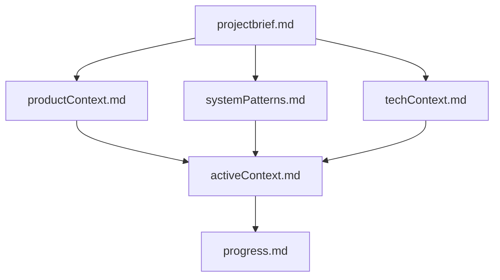

# System Patterns

## Architecture globale

```mermaid
flowchart TB
  subgraph frontend [Next.js App Router]
    Layout[layout.tsx + container]
    Home[HomeSections]
    Pages[projets / a-propos / contact]
    Blocks[HomeProjectIndexSection / ProjectDetail / PageContent]
    PT[CustomPortableText]
    Media[Media + Lightbox]
    Header[AreaHeader GSAP]
  end

  subgraph cms [Sanity]
    Studio[/studio embedded]
    Structure[structure + orderable list]
    Docs[project page home siteSettings]
  end

  subgraph data [Data layer]
    Fetch[fetch.ts + getHomePageData]
    Fallback[fallback-data.ts]
  end

  Home --> Fetch
  Pages --> Fetch
  Fetch -->|env| SanityAPI[Sanity CDN/API]
  Fetch -->|sinon| Fallback
  Studio --> Docs
```

## Hiérarchie documentation (Memory Bank)



## Patterns frontend

### Layout Grilli (14 colonnes)

- `.layout-grid` : 94vw mobile, `repeat(14, 1fr)` + gap 20px ≥ 600px
- `.content-type-column` : cols 1–3, `font-label` (16px)
- `.content-column` : cols 3–15 desktop
- `.library-overview-1column` / `-2columns` : index projets
- `.project-index-wide` : span 2 cols en grille 2 col

### Typographie (grillitype.com + Space Mono)

| Utility | Usage |
|---------|--------|
| `font-sans` (body) | 16px / 1.375 |
| `font-label` | Labels colonne, sidebar |
| `font-m` | Intro, lead texte |
| `font-xxl` | Index projets (vw scale) |

### Navigation area-font

- `AreaHeader` : `buttonVariants` navPrimary / navSecondary
- Scroll-hide GSAP
- Font 16px bold

### Home page builder

- `getHomePageData()` → `resolveHomeSections()`
- `projectSource: all` → ordre `orderRank` global
- `projectSource: manual` → array `items` + `listSpan`

### Portable Text / Media / Animations

- Config modulaire portable-text
- Media + lightbox + placeholders
- `useRevealOnScroll` + orchestrator

## Patterns Sanity

| Type | Rôle |
|------|------|
| `project` | Portfolio + `orderRank` |
| `page` | À propos, Contact |
| `home` | Singleton, `sections[]` page builder |
| `homeIntroSection` | Bloc intro |
| `homeProjectIndexSection` | Index projets configurable |
| `siteSettings` | Nav, footer, SEO |

**Structure Studio** : Accueil → Paramètres → Projets (ordre) → autres types

## Conventions code

- `cn()` + Tailwind v4 utility-first
- `container` pour marges globales
- Rouge = `brand` / `primary`, pas `accent`
- Server Components par défaut ; client pour GSAP, lightbox, index animé

## Routes

| Route | Composant |
|-------|-----------|
| `/` | `HomeSections` |
| `/projets/[slug]` | `ProjectDetail` |
| `/a-propos` | `PageContent` |
| `/contact` | `PageContent` |
| `/studio` | `NextStudio` |
