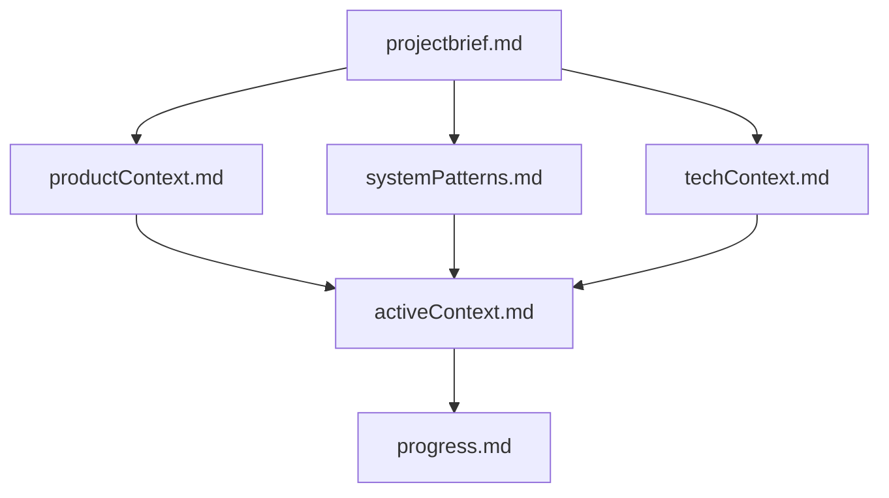

# System Patterns

## Architecture globale

```mermaid
flowchart TB
  subgraph frontend [Next.js App Router]
    Layout[layout.tsx + SiteContainer]
    Pages[page.tsx / projets / a-propos / contact]
    Blocks[ProjectList / ProjectDetail / PageContent]
    PT[CustomPortableText]
    Media[Media + Lightbox]
    Header[AreaHeader GSAP]
  end

  subgraph cms [Sanity]
    Studio[/studio embedded]
    Docs[project page home siteSettings]
  end

  subgraph data [Data layer]
    Fetch[src/lib/sanity/fetch.ts]
    Fallback[fallback-data.ts]
  end

  Pages --> Fetch
  Fetch -->|env configuré| SanityAPI[Sanity CDN/API]
  Fetch -->|sinon| Fallback
  Studio --> Docs
```

## Hiérarchie documentation (Memory Bank)



## Patterns frontend

### Layout Grilli (14 colonnes)

- `.layout-grid` : 94vw mobile, `repeat(14, 1fr)` + gap 20px ≥ 600px
- `.content-type-column` : cols 1–3, masqué mobile
- `.content-column` : cols 3–15 desktop
- `.description-column` : sidebar meta (cols 12–15 sur détail projet)

### Navigation area-font

- `AreaHeader` : logo + nav en boutons `btn-fixed` (primary / secondary)
- Scroll-hide via GSAP `translateY`
- Pas de sous-menus Blaze, pas cart/login

### Portable Text

- Config modulaire : `components/portable-text/config.tsx`
- Wrapper RSC-friendly : `CustomPortableText.tsx`
- Fallbacks `unknownBlockStyle` / `unknownType`

### Media

- `Media.tsx` : image Sanity ou placeholder gradient
- `yet-another-react-lightbox` pour zoom
- `createImageUrlBuilder` pour URLs CDN

### Animations

- `AnimationOrchestratorProvider` dans root layout
- `useRevealOnScroll` + ScrollTrigger pour sections
- `prefers-reduced-motion` : pas d’animation scroll

## Patterns Sanity

| Type | Rôle |
|------|------|
| `project` | Portfolio item principal |
| `page` | À propos, Contact |
| `home` | Singleton accueil (label section, intro) |
| `siteSettings` | Nav header, footer, SEO global |
| `blockContent` | Corps riche partagé |

**Singleton IDs fixes** (seed) : `siteSettings`, `home`, `page-a-propos`, `page-contact`, `project-{slug}`

## Conventions code

- `cn()` depuis `src/lib/utils.ts` pour classNames
- Server Components par défaut ; `"use client"` pour GSAP, lightbox, header
- Pas de secrets dans le repo ; `.env.local` gitignored
- Commits : messages en anglais ou français, focus sur le why

## Routes

| Route | Composant |
|-------|-----------|
| `/` | `ProjectList` + intro home |
| `/projets/[slug]` | `ProjectDetail` (SSG via `generateStaticParams`) |
| `/a-propos` | `PageContent` |
| `/contact` | `PageContent` |
| `/studio` | `NextStudio` |
