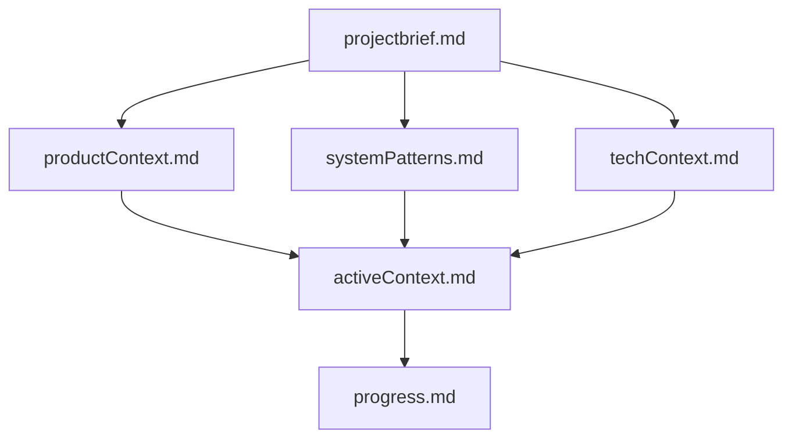

# System Patterns

## Architecture globale

```mermaid
flowchart TB
  subgraph frontend [Next.js App Router]
    Layout[layout.tsx + container]
    Home[HomeSections]
    Pages[projets / a-propos / contact]
    Blocks[ProjectIndex sticky / ProjectDetail / PageContent]
    PT[CustomPortableText]
    Media[Media + Lightbox]
    Header[AreaHeader GSAP]
    Lenis[SmoothScroll Lenis]
  end

  subgraph cms [Sanity]
    Studio[/studio embedded]
    Structure[structure + orderable list]
    Docs[project page home siteSettings]
  end

  subgraph data [Data layer]
    Fetch[fetch.ts + getHomePageData]
    Fallback[fallback-data.ts]
  end

  Home --> Fetch
  Pages --> Fetch
  Home --> Lenis
  Fetch -->|env| SanityAPI[Sanity CDN/API]
  Fetch -->|sinon| Fallback
  Studio --> Docs
```

## Hiérarchie documentation (Memory Bank)

```mermaid
flowchart TD
    PB[projectbrief.md] --> PC[productContext.md]
    PB --> SP[systemPatterns.md]
    PB --> TC[techContext.md]
    PC --> AC[activeContext.md]
    SP --> AC
    TC --> AC
    AC --> PR[progress.md]
```

## Patterns frontend

### Layout Grilli (14 colonnes)

- `.layout-grid` : 94vw mobile, `repeat(14, 1fr)` + gap 20px ≥ 600px
- `.content-type-column` : cols 1–3, `font-label` (16px)
- `.content-column` : cols 3–15 desktop
- `.library-overview-1column` / `-2columns` : index projets
- `.project-index-wide` : span 2 cols en grille 2 col

### Typographie (Neue Montreal)

| Utility | Usage |
|---------|--------|
| `font-display` | Hero `h1` |
| `font-h2` | Titres projet, services |
| `font-body` | Manifeste, texte courant |
| `font-caption` | Légendes médias |
| `font-tag` | Catégories, nav, marquee |
| `font-m` / `font-label` | Pages projet / à-propos (legacy Grilli) |

### Home page builder

- `getHomePageData()` → `ensureHomeSections()` + `resolveHomeSections()`
- `home.projects[]` → blocs sticky ; `rows` / `items` legacy en fallback
- `project.homeRows[]` (`single` \| `pair`) ; synthèse depuis cover/gallery si vide
- Composants : `HeroTitle`, `SiteMarquee`, `ServicesStatement`, `ManifestoBox`, `ProjectIndex`, `ProjectBlock`, `ProjectMediaRow`, `HomeFooter`

### Navigation area-font

- `AreaHeader` : `buttonVariants` navPrimary / navSecondary
- Scroll-hide GSAP
- Font 16px bold

### Portable Text / Media / Animations

- Config modulaire portable-text
- Media + lightbox + placeholders
- `useRevealOnScroll` + orchestrator

## Patterns Sanity

| Type | Rôle |
|------|------|
| `project` | Portfolio + `orderRank` |
| `page` | À propos, Contact |
| `home` | Singleton, `sections[]` page builder |
| `homeIntroSection` | Bloc services (uppercase) |
| `homeManifestoSection` | Box manifeste |
| `homeProjectIndexSection` | Index sticky (`projects[]`, `rows` legacy) |
| `homeMediaRow` | Rangée médias d’un projet |
| `siteSettings` | Nav, footer, SEO |

**Structure Studio** : Accueil → Paramètres → Projets (ordre) → autres types

## Conventions code

- `cn()` + Tailwind v4 utility-first
- `container` pour marges globales
- Rouge = `brand` / `primary`, pas `accent`
- Server Components par défaut ; client pour GSAP, lightbox, index animé

## Routes

| Route | Layout | Composant |
|-------|--------|-----------|
| `/` | `(site)` | `HomeSections` |
| `/projets/[slug]` | `(site)` | `ProjectDetail` |
| `/a-propos` | `(site)` | `PageContent` |
| `/contact` | `(site)` | `PageContent` |
| `/studio` | `studio` (h-dvh) | `NextStudio` |

**Route groups** : `(site)/layout.tsx` = `AreaHeader` + `SiteContainer` + `Footer` ; `studio/layout.tsx` = plein écran sans chrome site.

**Studio embedded** : `sanity.config.ts` → `basePath: "/studio"` aligné avec `app/studio/[[...tool]]/page.tsx`.
